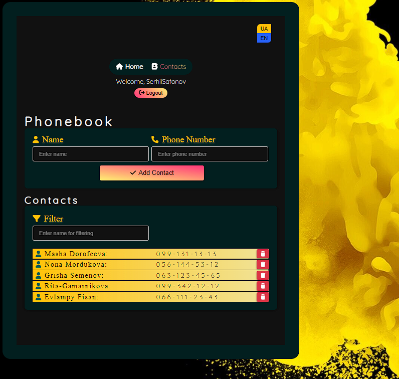

**Read in another language: [Ukrainian](README.ua.md).**

# PhoneBook

This repository contains a project designed for managing phone contacts.

## Table of contents

- [Project overview](#project-overview)
- [Technologies used](#technologies-used)
- [Installation](#instalattion)
- [Server Commands](#server-commands)

## Project Overview

- Registration/Authorization
- Adding and deleting contacts
- Contact filtering
- Routing

This project is a web application for managing contacts, including functions for
registering and authorizing users, adding and deleting contacts, and filtering
contacts. The app allows users to register, log in and manage their contacts
securely. Users can add new contacts, remove unnecessary ones, and filter
contacts based on specific criteria such as name or email.

## Technologies Used

React Redux Toolkit Axios React-i18next Notiflix ReactLoaderSpinner
ReactToastify ReduxThunk ReduxPersist

## Installation

1. Clone this repository to your local computer.
2. Open the terminal and navigate to the root folder of the project.
3. Run the command `npm install` to install project dependencies.

## Server Commands

**npm:**

- `npm start` — Start the server in production mode.
- `npm start:dev` — Start the server in development mode.
- `npm run lint` — Run code linting using eslint. Perform this before each PR
  and fix all linting errors.
