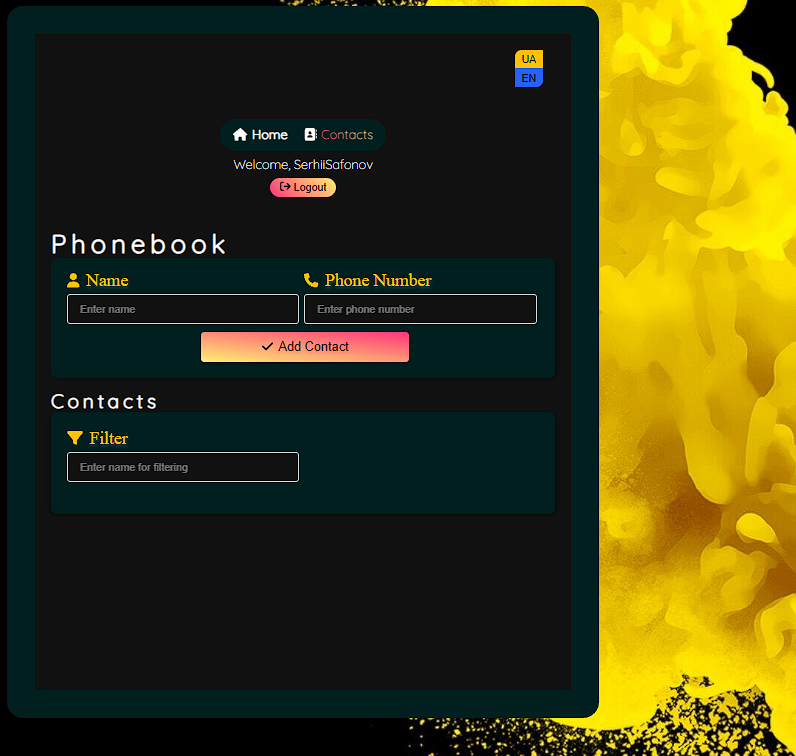

**Читати іншою мовою: [Англійська](README.md).**

# PhoneBook

У цьому репозиторії знаходиться проект, який створений для управління
телефонними контактами.

## Зміст

- [Огляд проекту](#огляд-проекту)
- [Використані технології](#використані-технології)
- [Інсталяція](#інсталяція)
- [Команди сервера](#команди-сервера)

## Огляд проекту

- Реєстрація/Авторизація
- Додавання та видалення контактів
- Фільтрація контактів
- Маршрутизація

Цей проект являє собою веб-додаток для керування контактами, що включає функції
реєстрації та авторизації користувачів, додавання та видалення контактів, а
також фільтрування контактів. Програма дозволяє користувачам зареєструватися,
увійти в систему та безпечно керувати своїми контактами. Користувачі можуть
додавати нові контакти, видаляти непотрібні та фільтрувати контакти за певними
критеріями, такими як ім'я або електронна пошта.

## Використані технології

React Redux Toolkit Axios React-i18next Notiflix ReactLoaderSpinner
ReactToastify ReduxThunk ReduxPersist

## Інсталяція

1. Склонуйте цей репозиторій на свій локальний комп'ютер.
2. Відкрийте термінал і перейдіть до кореневої теки проекту.
3. Запустіть команду `npm install`, щоб встановити залежності проекту.

## Команди сервера

**npm:**

- `npm start` — Запустити сервер у режимі продакшену.
- `npm start:dev` — Запустити сервер у режимі розробки.
- `npm run lint` — Запустити лінтування коду за допомогою eslint. Виконайте це
  перед кожним PR та виправте всі помилки лінтування.
